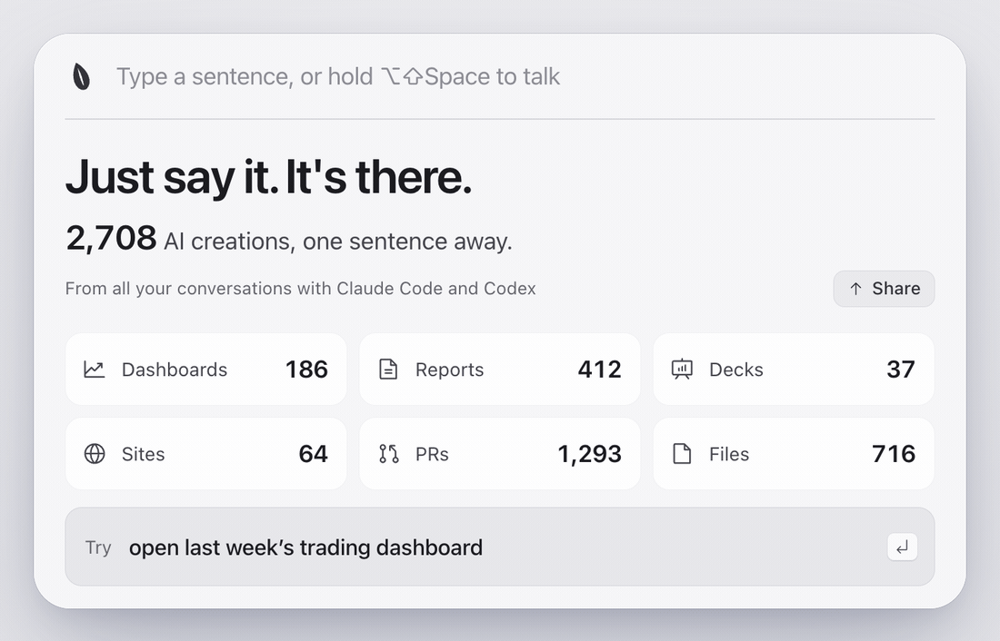
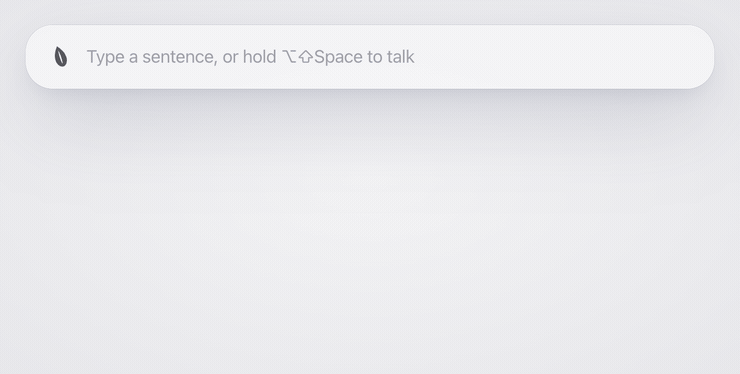
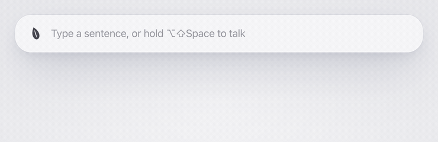
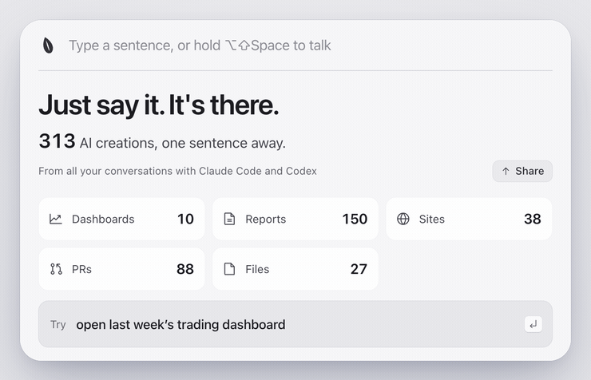
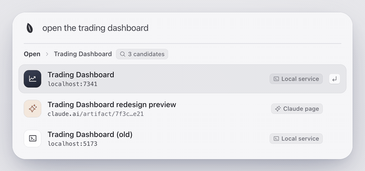
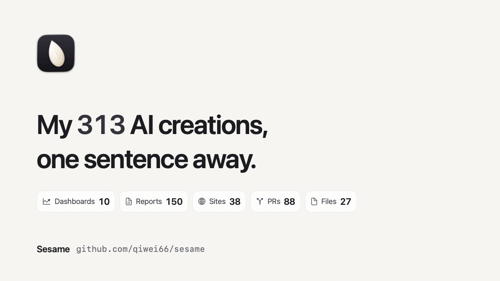

<p align="center">
  
</p>

<h1 align="center">Sesame</h1>

<p align="center"><b>Stop digging through chats.</b><br>Your library of AI creations: say a sentence and get back anything Claude Code or Codex delivered.</p>

<p align="center">
  <a href="LICENSE"></a>
  
  <a href="https://github.com/qiwei66/sesame/releases/latest"></a>
  
</p>

<p align="center"><a href="README_zh.md">中文</a></p>

<p align="center">
  <picture>
    <source media="(prefers-color-scheme: dark)" srcset="docs/assets/hero-firstrun-en-dark.gif">
    
  </picture>
</p>

<p align="center"><a href="https://github.com/qiwei66/sesame/releases/download/v0.1.0/sesame-promo-en.mp4">▶ Watch the full promo (44 s)</a></p>

Your AI builds dashboards, reports, decks, sites and pull requests. A week later they are buried in long chats.
Sesame keeps a local library of every artifact your AI delivered, so a few words bring it back: the artifact itself, not the chat it came from.

## What it does

<table>
  <tr>
    <td width="36%">
      <h3>Type, and it's already there</h3>
      Results show up with the first letters. ↑ ↓ to pick, ↵ to open. If nothing local fits, ↵ lets Sesame search everything.
    </td>
    <td width="64%">
      <picture>
        <source media="(prefers-color-scheme: dark)" srcset="docs/assets/typing-en-dark.gif">
        
      </picture>
    </td>
  </tr>
</table>

<table>
  <tr>
    <td width="64%">
      <picture>
        <source media="(prefers-color-scheme: dark)" srcset="docs/assets/voice-en-dark.gif">
        
      </picture>
    </td>
    <td width="36%">
      <h3>Hold the hot key and say it</h3>
      Hot key: ⌥⇧Space (switch to ⌘Space in Settings). Tap it to type; hold it to talk, let go to send. "Open last week's trading dashboard" opens the dashboard itself.
    </td>
  </tr>
</table>

<table>
  <tr>
    <td width="36%">
      <h3>Useful the moment you install it</h3>
      On first launch it reads your existing Claude Code and Codex history and counts every artifact your AI delivered.
    </td>
    <td width="64%">
      <picture>
        <source media="(prefers-color-scheme: dark)" srcset="docs/assets/firstrun-en-dark.gif">
        
      </picture>
    </td>
  </tr>
</table>

<table>
  <tr>
    <td width="64%">
      <picture>
        <source media="(prefers-color-scheme: dark)" srcset="docs/assets/pick-en-dark.gif">
        
      </picture>
    </td>
    <td width="36%">
      <h3>More than one match? Pick one</h3>
      When several names fit, you get a short list instead of a guess; when none fits, it says so instead of offering filler. Local services, Claude pages, files, PRs, sites and online docs all count.
    </td>
  </tr>
</table>

<table>
  <tr>
    <td width="36%">
      <h3>Share your number</h3>
      Share on the first-run panel turns your number into a 1200×675 image, saves it to Downloads and copies it, ready to paste into a post. Only counts are on it: no titles, paths or names.
    </td>
    <td width="64%">
      <picture>
        <source media="(prefers-color-scheme: dark)" srcset="docs/assets/share-en-dark.png">
        
      </picture>
    </td>
  </tr>
</table>

## Install

```bash
brew install qiwei66/tap/sesame
mkdir -p ~/Applications && { [ ! -e ~/Applications/Sesame.app ] || [ -L ~/Applications/Sesame.app ] || mv ~/Applications/Sesame.app ~/Applications/Sesame.app.bak-$(date +%Y%m%d%H%M%S); } && ln -sfn "$(brew --prefix)/opt/sesame/Sesame.app" ~/Applications/Sesame.app && open ~/Applications/Sesame.app
```
<!-- the tap is github.com/qiwei66/homebrew-tap (formula source: packaging/homebrew/) -->

The second line puts Sesame.app in `~/Applications` and starts it (an older copy from `make install` is kept as
`Sesame.app.bak-<time>`). Homebrew brings Node.js, builds the app from source on your Mac and ad-hoc signs it: no Gatekeeper warning, no Apple
Developer account needed.

Or install from source (Node.js 22.18+ and the Xcode Command Line Tools, `xcode-select --install`):

```bash
git clone https://github.com/qiwei66/sesame.git
cd sesame
make install
open ~/Applications/Sesame.app
```

`make uninstall` removes it and keeps your settings. The hot key is ⌥⇧Space; switch to ⌘Space in Settings › Hot key.

## Use it in Claude Code

Sesame also runs inside Claude Code as a plugin. Ask in plain words in any session and Claude looks it up in your
library, then opens it on your Mac. The app is optional: without it, the plugin builds the same local index from
your Claude Code and Codex history; with it, both share one index.

```bash
claude plugin marketplace add qiwei66/sesame && claude plugin install sesame@sesame
```

Inside a session, `/plugin marketplace add qiwei66/sesame` and then `/plugin install sesame@sesame` do the same.
It needs Node.js 22.18+ with npm, which Claude Code uses to install the plugin's packages.

> **You:** Where is the trading dashboard from last week?
>
> **Claude:** *(search_artifacts → open_artifact)* Found it: your **Trading Dashboard** is a local web service at
> http://127.0.0.1:8787, last seen on September 27. It's opening in your browser now.

> **You:** Open the report I made yesterday
>
> **Claude:** *(search_artifacts → open_artifact)* Found yesterday's report, **Q3 sales report** (a Markdown file),
> and opened it.

Already installed the app with Homebrew or `make install`? Its `va` works as an MCP server too:
`claude mcp add sesame -- va mcp`.

Three tools: `search_artifacts` (title, type, link, time and source session of each match), `open_artifact` and
`artifact_stats`. Any other MCP client can run the same server with `va mcp`; see [docs/mcp.md](docs/mcp.md).

## Privacy

- The index stays on your Mac (`~/Library/Application Support/Sesame`) and is never uploaded.
- Sesame only reads `~/.claude/projects` and `~/.codex/sessions`, and never writes to them.
- A model is optional. If you set one up, it gets your sentence, your app names and, when local search can't
  decide, each candidate's type, title and a few keywords. Never full links, file paths or your clipboard.
- In Claude Code, the matches you ask about (title, type, link, time) go to the model of that conversation, the same
  one you are already talking to. Nothing goes anywhere else.

## More

System actions (disk space, moving files to the Trash), custom commands, skills and model setup: [docs/advanced.md](docs/advanced.md).

## License

MIT, see [LICENSE](LICENSE).
