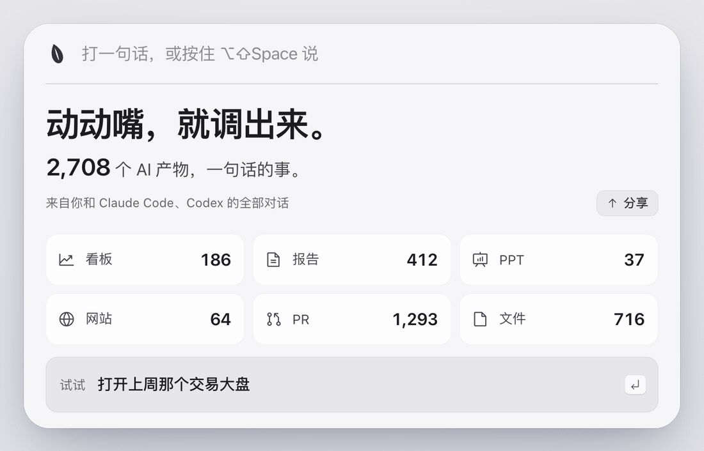
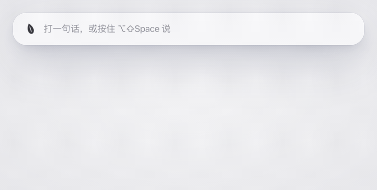
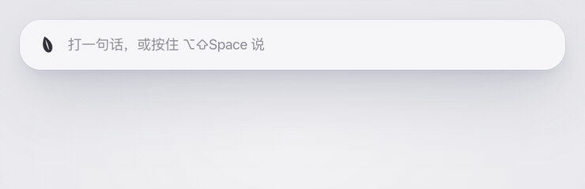
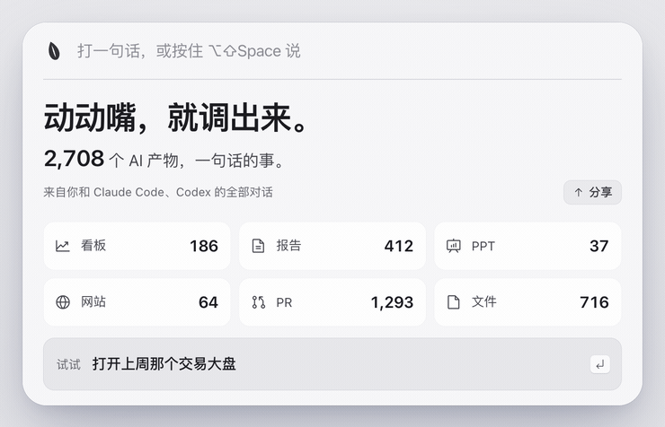
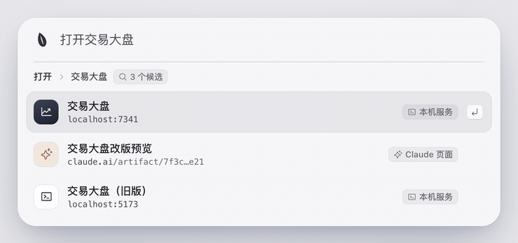
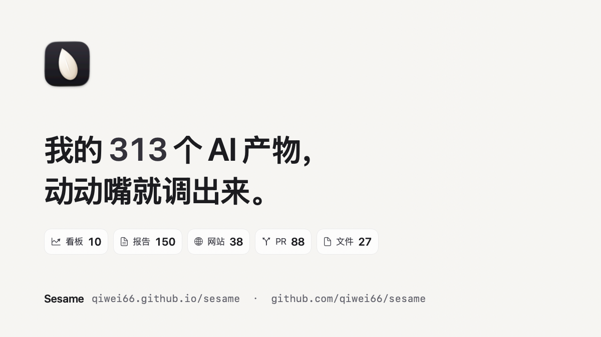

<p align="center">
  
</p>

<h1 align="center">Sesame（芝麻）</h1>

<p align="center"><b>别再翻会话了。</b><br>你的 AI 产物库：说一句话，就能找回 Claude Code、Codex 交付过的任何产物。</p>

<p align="center">
  <a href="LICENSE"></a>
  
  <a href="https://github.com/qiwei66/sesame/releases/latest"></a>
  
</p>

<p align="center"><a href="https://qiwei66.github.io/sesame/zh/"><b>官网</b></a> · <a href="README.md">English</a></p>

<p align="center">
  <picture>
    <source media="(prefers-color-scheme: dark)" srcset="docs/assets/hero-firstrun-zh-dark.gif">
    
  </picture>
</p>

<p align="center"><a href="https://github.com/qiwei66/sesame/releases/download/v0.1.0/sesame-promo-zh.mp4">▶ 看完整宣传片（44 秒）</a></p>

AI 帮你做了看板、报告、PPT、网站、PR，过一周就全埋在长长的会话里了。
Sesame 在本机把 AI 交付过的产物收成一个库，打几个字或说一句话就能找回来，打开的是产物本身，不是当时那段对话。

## 它能做什么

<table>
  <tr>
    <td width="36%">
      <h3>边打字边出结果</h3>
      打第一个字就有结果。↑ ↓ 选，↵ 打开。本地对不上时，按 ↵ 让 Sesame 去全部记录里找。
    </td>
    <td width="64%">
      <picture>
        <source media="(prefers-color-scheme: dark)" srcset="docs/assets/typing-zh-dark.gif">
        
      </picture>
    </td>
  </tr>
</table>

<table>
  <tr>
    <td width="64%">
      <picture>
        <source media="(prefers-color-scheme: dark)" srcset="docs/assets/voice-zh-dark.gif">
        
      </picture>
    </td>
    <td width="36%">
      <h3>按住热键直接说</h3>
      热键：⌥⇧Space（可在设置里换成 ⌘Space）。轻按打开面板打字；按住说，松开就发送。说「打开上周那个交易大盘」，打开的是大盘本身。
    </td>
  </tr>
</table>

<table>
  <tr>
    <td width="36%">
      <h3>装上就有</h3>
      第一次打开，它会读一遍你已有的 Claude Code 和 Codex 记录，数一数 AI 一共交付过多少产物。
    </td>
    <td width="64%">
      <picture>
        <source media="(prefers-color-scheme: dark)" srcset="docs/assets/firstrun-zh-dark.gif">
        
      </picture>
    </td>
  </tr>
</table>

<table>
  <tr>
    <td width="64%">
      <picture>
        <source media="(prefers-color-scheme: dark)" srcset="docs/assets/pick-zh-dark.gif">
        
      </picture>
    </td>
    <td width="36%">
      <h3>不止一个？挑一个</h3>
      名字都对得上的不止一个时，给你一个短列表，不瞎猜；一个都对不上就直接说没找到，不拿凑数的顶上。本机服务、Claude 页面、文件、PR、网站、在线文档都算。
    </td>
  </tr>
</table>

<table>
  <tr>
    <td width="36%">
      <h3>分享你的数字</h3>
      开场页右边的「分享」把你的数字做成一张 1200×675 的图，存进「下载」并复制好，直接贴到推特。图上只有计数，没有任何标题、路径或名字。
    </td>
    <td width="64%">
      <picture>
        <source media="(prefers-color-scheme: dark)" srcset="docs/assets/share-zh-dark.png">
        
      </picture>
    </td>
  </tr>
</table>

## 安装

```bash
brew install qiwei66/tap/sesame
mkdir -p ~/Applications && { [ ! -e ~/Applications/Sesame.app ] || [ -L ~/Applications/Sesame.app ] || mv ~/Applications/Sesame.app ~/Applications/Sesame.app.bak-$(date +%Y%m%d%H%M%S); } && ln -sfn "$(brew --prefix)/opt/sesame/Sesame.app" ~/Applications/Sesame.app && open ~/Applications/Sesame.app
```
<!-- tap 仓库是 github.com/qiwei66/homebrew-tap（formula 源文件在 packaging/homebrew/） -->

第二行把 Sesame.app 放进 `~/Applications` 并启动（之前 `make install` 装的旧副本会改名为 `Sesame.app.bak-<时间>` 留着）。Homebrew 会装好 Node.js，在你的 Mac 上从源码编译 App 并 ad-hoc 签名，不弹 Gatekeeper 警告，也不需要苹果开发者账号。

也可以从源码装（需要 Node.js 22.18 以上和 Xcode 命令行工具 `xcode-select --install`）：

```bash
git clone https://github.com/qiwei66/sesame.git
cd sesame
make install
open ~/Applications/Sesame.app
```

`make uninstall` 卸载，设置会保留。热键默认 ⌥⇧Space，可在「设置 → 热键」里换成 ⌘Space。

## 在 Claude Code 里用

Sesame 也能作为插件跑在 Claude Code 里。在任何会话里直接说要找什么，Claude 会去你的产物库里查，再在你的 Mac 上打开。
App 装不装都行：没装时插件自己从 Claude Code 和 Codex 的历史里建同样的本地索引；装了就和 App 共用一份索引。

```bash
claude plugin marketplace add qiwei66/sesame && claude plugin install sesame@sesame
```

也可以在会话里先输入 `/plugin marketplace add qiwei66/sesame`，再输入 `/plugin install sesame@sesame`。
需要 Node.js 22.18+ 和 npm（Claude Code 用 npm 安装插件依赖）。

> **你：** 上周那个看板在哪
>
> **Claude：** *（search_artifacts → open_artifact）* 找到了：**Trading Dashboard**，本机服务 `http://127.0.0.1:8787`，
> 上周末（09-27）最后用过，已经在浏览器里打开。

> **你：** 把我昨天做的报告打开
>
> **Claude：** *（search_artifacts → open_artifact）* 找到了你昨天的报告 **Q3 sales report**（Markdown 文件），已为你打开。

已经用 Homebrew 或 `make install` 装好 App 的，自带的 `va` 也能直接当 MCP 服务用：`claude mcp add sesame -- va mcp`。

一共三个工具：`search_artifacts`（每条结果带标题、类型、地址、时间和来源会话）、`open_artifact`、`artifact_stats`。
其它 MCP 客户端用 `va mcp` 跑同一个服务，见 [docs/mcp.md](docs/mcp.md)。

## 隐私

- 索引只存在你的 Mac 上（`~/Library/Application Support/Sesame`），不会上传。
- Sesame 只读 `~/.claude/projects` 和 `~/.codex/sessions`，从不往里写。
- 模型可配可不配。配了的话，发出去的只有你说的那句话、已装 App 的名字，以及本地拿不准时各候选的类型、标题和几个关键词；完整链接、文件路径、剪贴板都不发。
- 在 Claude Code 里用时，你问到的那几条结果（标题、类型、地址、时间）会交给这个会话正在用的模型，也就是你本来就在对话的那个模型，不发给别处。

## 更多

查磁盘、移到废纸篓这类系统动作，自定义命令、技能插件和模型配置，见 [docs/advanced.md](docs/advanced.md)。

## 许可证

MIT，见 [LICENSE](LICENSE)。
