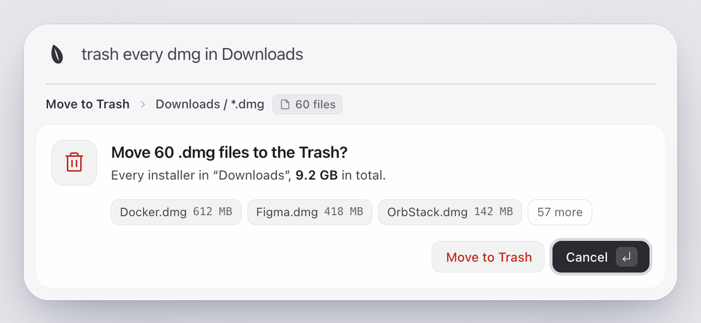
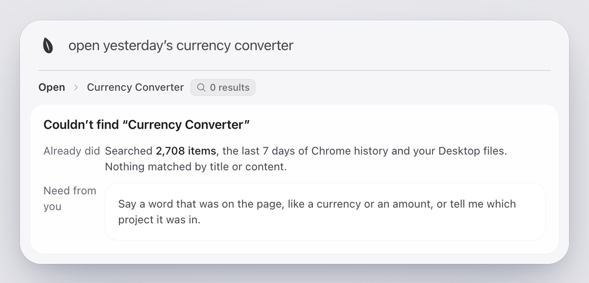
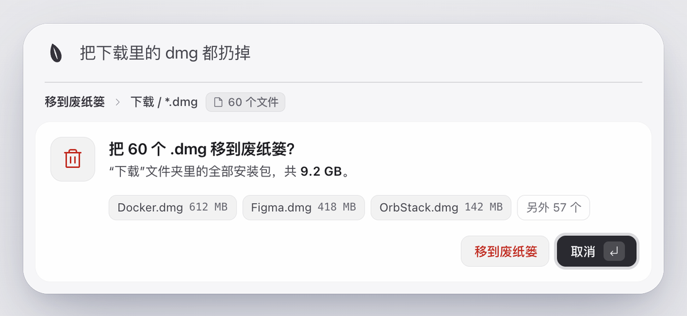
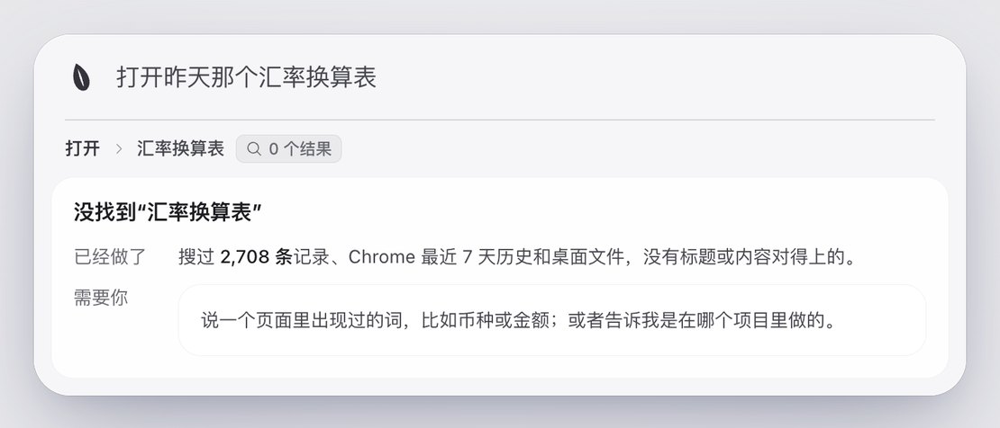

# Advanced · 进阶

[English](#english) · [中文](#中文)

## English

Sesame is first of all a library of what your AI delivered (see the [README](../README.md)). Everything below is
optional and lives outside the repo, in `~/.config/voice-agent/`.

### System actions

Besides opening your AI's work, a sentence can run a few system actions: how much disk is left, battery, moving files
to the Trash, quitting an app. Anything you cannot undo asks first, and the default button is Cancel.

<picture>
  <source media="(prefers-color-scheme: dark)" srcset="assets/confirm-en-dark.png">
  
</picture>

When nothing fits, it says where it looked and what it still needs from you, instead of opening a wrong match.

<picture>
  <source media="(prefers-color-scheme: dark)" srcset="assets/miss-en-dark.png">
  
</picture>

### Custom commands

Give a shell command a name and say it. The command is fixed and runs without a shell. See [commands.md](commands.md).

### Skills

One TypeScript file adds a tool, like "open ticket 123". See [skills.md](skills.md).

### Models

A model is optional: without one, names and "open …" are answered from the local index. With one, Sesame also
understands vaguer sentences and system actions. Any OpenAI-compatible endpoint works; DeepSeek, OpenAI, Ollama and
LM Studio are preset (the last two need no key). See [config.md](config.md).

### For developers

The app talks to the core over JSON-RPC ([rpc.md](rpc.md)). `make test` runs the tests; app internals are in
[macos/README.md](../macos/README.md). `npm run eval:real` measures search on your own index (answers in
`~/.config/voice-agent/eval-real.json`, see the header of `scripts/eval-real.ts`).

## 中文

Sesame 首先是 AI 产物库（见 [README](../README_zh.md)）。下面这些都是可选的，个人设置放在 `~/.config/voice-agent/`，不进仓库。

### 系统动作

除了打开 AI 交付过的产物，一句话还能做几件系统上的事：查磁盘还剩多少、查电量、把文件移到废纸篓、退出 App。撤不回来的操作一定先问，默认按钮是「取消」。

<picture>
  <source media="(prefers-color-scheme: dark)" srcset="assets/confirm-zh-dark.png">
  
</picture>

找不到时，告诉你已经搜过哪里、还需要你补什么，不会随便打开一个错的。

<picture>
  <source media="(prefers-color-scheme: dark)" srcset="assets/miss-zh-dark.png">
  
</picture>

### 自定义命令

给一条 shell 命令起个名字，说出来就能跑。命令本身是固定的，不经过 shell 执行。见 [commands.md](commands.md)。

### 技能插件

一个 TypeScript 文件加一个工具，比如「打开 123 号工单」。见 [skills.md](skills.md)。

### 模型

模型可配可不配：不配时，说名字或「打开 …」由本地索引直接回答；配上后能听懂更模糊的说法，也能做系统动作。任何 OpenAI 兼容接口都行，已预置 DeepSeek、OpenAI、Ollama、LM Studio，后两个不需要 key。见 [config.md](config.md)。

### 开发

App 和核心之间走 JSON-RPC（[rpc.md](rpc.md)）。`make test` 跑测试，App 内部结构见 [macos/README.md](../macos/README.md)。`npm run eval:real` 在你自己的索引上量检索质量（答案文件在 `~/.config/voice-agent/eval-real.json`，格式见 `scripts/eval-real.ts` 开头）。
